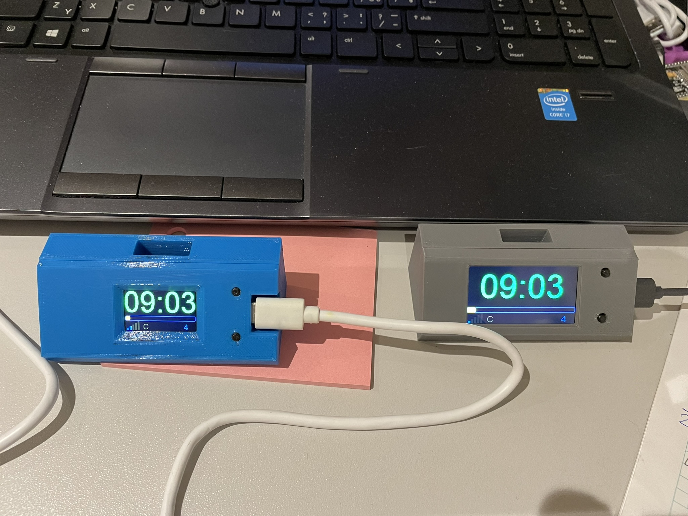
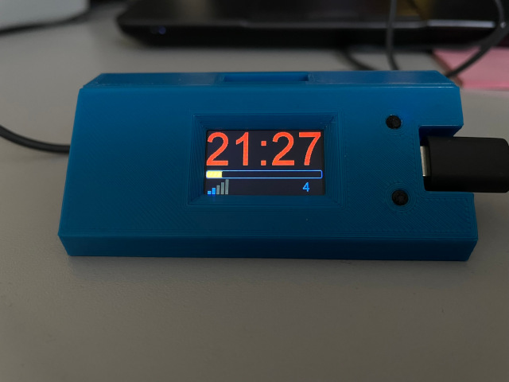
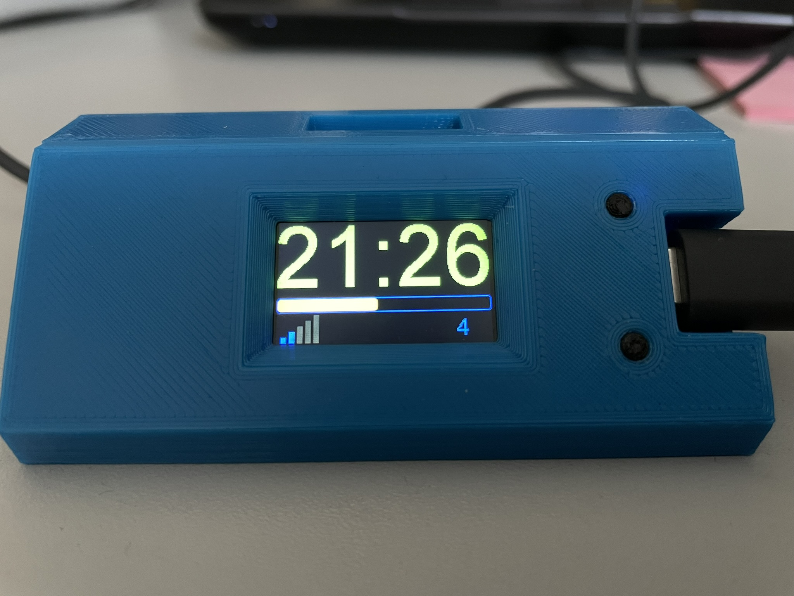
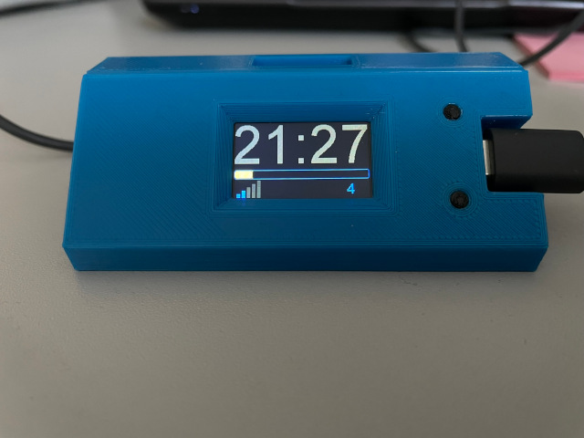
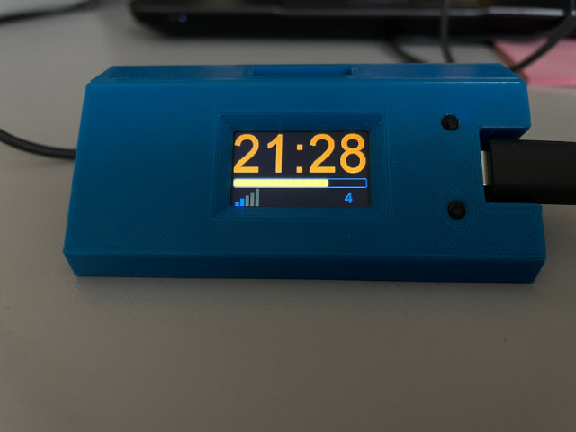

# T-Display_MrClock

MrClock game watches running on LILYGO T-Display and T-Display-S3.

Whole project is provided for free and personal use only. Not for commercial use!

On main display are shown 4 statuses
MrClock itself
bargraph is showing seconds. It is calculated according to speed. This is due to quite long delay between
receiving of packets, usually it is aprox 2 sec, but time to time packet is lost (due to UDP) than delay
can be up to 15 sec.
Last row in display shows few statuses:
strength of WiFi signal with showing disconection
mode C - client, S - server, A - stand alone. At the moment is only C - client
In long gap can be diplayed red "! UPD !" - signaling availability of firmware update here at github.
Small number in right bottom coner showing speed of MrClock / timekeeper in fact fastspeed clock.

clock are showing statuses of MRClock as follow:

## MrClock is available

RED  clock is STOPPED

GREEN clock is RUNNING

## MrClock is not available

GREY previously was stopped

ORANGE previously was running, shown time is calculated from previous speed

Delay between MrClock is available and lost signal is setted at 20 sec due to time to time lost packets.

For connection to SSID (WiFi) long press bottom button (>1000ms). Bottom mean, that buttons are on right side from display.
How to connect is shown on display. After start of WiFiManager you have 60sec for connection.
Then WiFiManager is automaticaly shutdown.
With WiFimanager you can also delete stored credentials of set WiFi.

When on display is showen red ! UPD ! is ready new firmware version. For update press top button for install.
During update do not disconnect power supply! Whole process can take up to 5 minutes.

3D file is made with DesignSpark Mechanical version 6.0.3. Software is provided for free of charge at RS-Componnets.
Screws for closing I used woodscrew lenght 11mm dia 2.5mm
